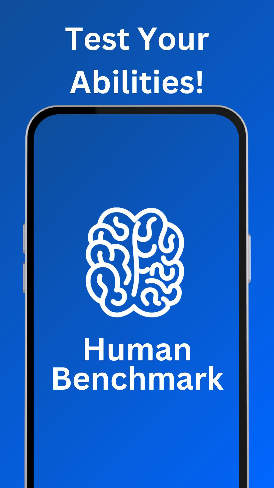
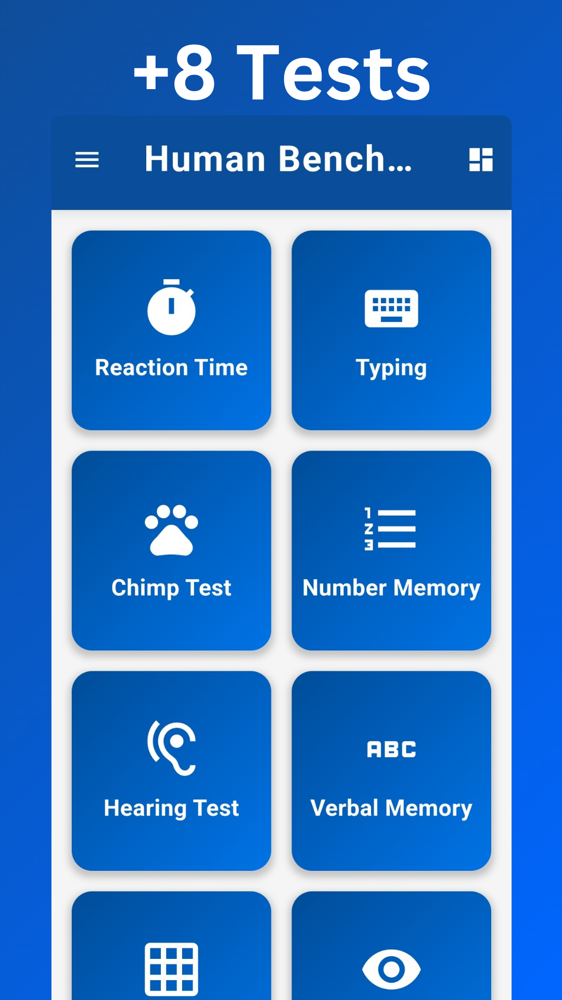
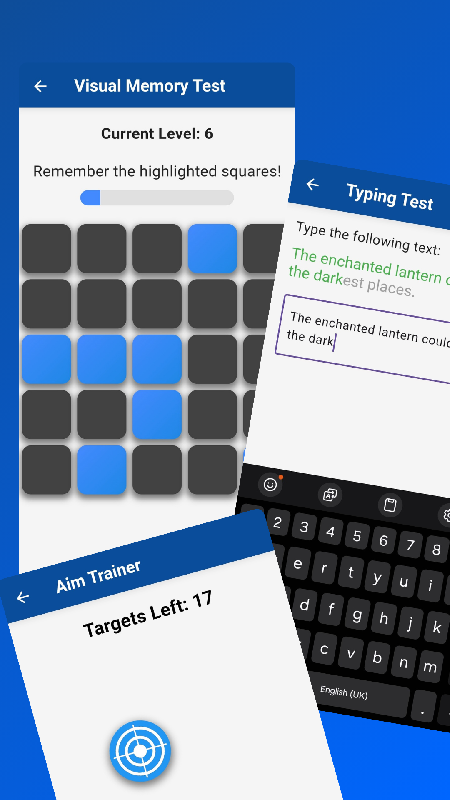
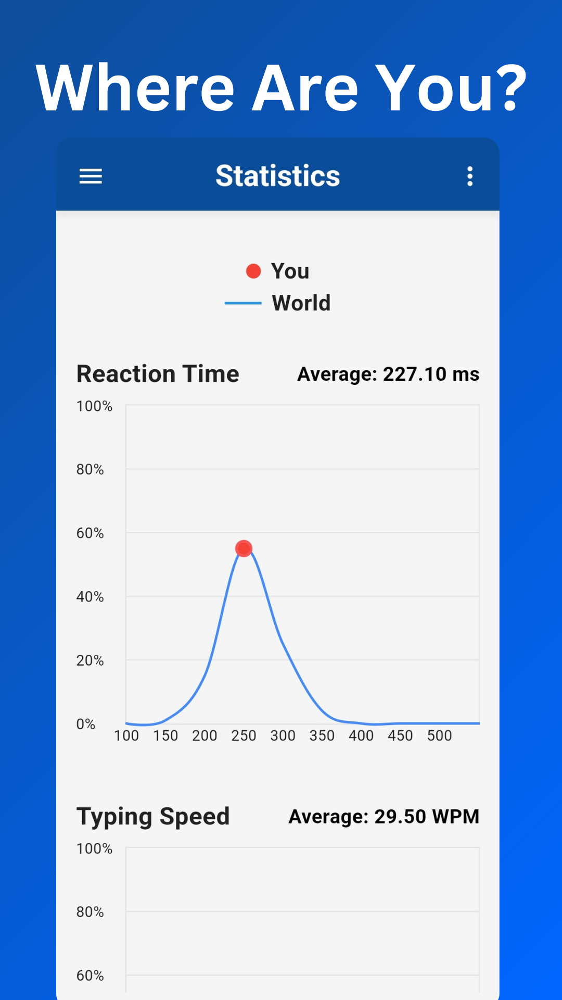

# Human Benchmark

Human Benchmark is a mobile application designed to test and improve your cognitive abilities through a series of fun and challenging tests. The app offers various tests, including verbal memory, reaction time, pattern recognition, aim training, and typing tests, each designed to measure different aspects of your mental capabilities.

    
    
    
    

## Features

- **Comprehensive Testing**: Test yourself in various areas, including Reaction Time, Typing, Chimp Test, Number Memory, Hearing Test, Verbal Memory, Sequence Memory, Visual Memory, Aim Training, Info Retention, and Intelligence Quotient.
- **Statistics**: Compare your performance to others around the world.
- **Share Your Statistics**: Easily share an image of your statistics with friends or on social media.
- **Offline Access**: Enjoy the app fully without needing an internet connection; it's 100% offline.

## Acknowledgments

Thanks to the Flutter community for providing great resources and support. This app is heavily inspired by the original [Human Benchmark](https://humanbenchmark.com) website.

## License

This project is licensed under the GNU General Public License v3.0 License. For more details, please read the [LICENSE](LICENSE) file.